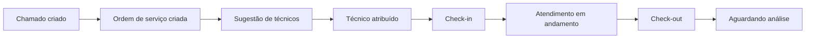
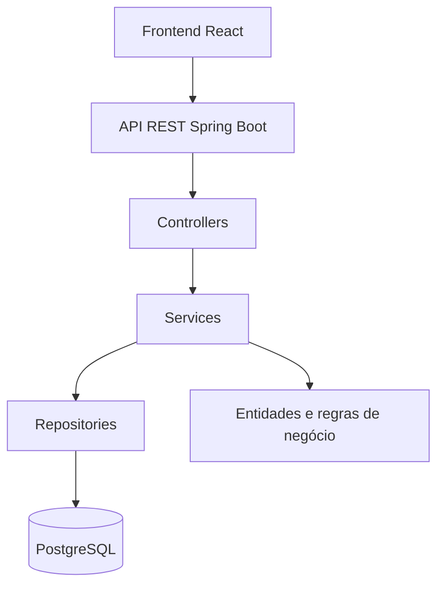

# Smart Dispatch

Sistema full stack para gestão de chamados técnicos, criação de ordens de serviço e distribuição inteligente de atendimentos entre profissionais.

O Smart Dispatch centraliza o fluxo operacional desde a abertura do chamado até a conclusão do atendimento, mantendo a rastreabilidade das alterações e auxiliando na escolha do técnico mais adequado para cada ordem de serviço.

> Projeto autoral em desenvolvimento, criado para consolidar conhecimentos em Java, Spring Boot, APIs REST, React, TypeScript, PostgreSQL e modelagem de regras de negócio.

---

## Sumário

- [Visão geral](#visão-geral)
- [Funcionalidades](#funcionalidades)
- [Sugestão inteligente de técnicos](#sugestão-inteligente-de-técnicos)
- [Fluxo operacional](#fluxo-operacional)
- [Demonstração](#demonstração)
- [Arquitetura](#arquitetura)
- [Tecnologias](#tecnologias)
- [Estrutura do projeto](#estrutura-do-projeto)
- [Executando localmente](#executando-localmente)
- [Configuração e segurança](#configuração-e-segurança)
- [Status do projeto](#status-do-projeto)
- [Decisões técnicas](#decisões-técnicas)
- [Autor](#autor)

---

## Visão geral

Operações de suporte técnico normalmente precisam administrar diversos chamados, unidades de atendimento, contratos e profissionais disponíveis.

Quando esse processo é controlado manualmente, alguns problemas podem surgir:

- distribuição desequilibrada das ordens de serviço;
- dificuldade para acompanhar atendimentos em andamento;
- perda do histórico de alterações;
- pouca visibilidade sobre a carga atual dos técnicos;
- dificuldade para identificar o profissional mais adequado;
- ausência de rastreabilidade sobre as ações realizadas.

O Smart Dispatch foi criado para organizar esse fluxo em uma única plataforma.

---

## Funcionalidades

### Gestão de chamados

- criação de chamados;
- edição dos dados do chamado;
- associação com contrato e unidade;
- registro dos dados do solicitante;
- classificação por tipo, categoria e prioridade;
- atualização manual e automática de status;
- busca por palavras-chave;
- filtros por contrato e status;
- ordenação por data de abertura;
- acesso aos detalhes operacionais do chamado.

A busca local permite localizar chamados utilizando informações como:

- número do chamado;
- unidade;
- cidade;
- solicitante;
- telefone;
- e-mail;
- identificação;
- patrimônio;
- categoria;
- prioridade;
- status;
- descrição.

### Ordens de serviço

- criação de uma ou mais ordens de serviço para o mesmo chamado;
- escolha da unidade de atendimento;
- atribuição de técnico;
- alteração do técnico responsável;
- remoção do técnico;
- registro da data de atribuição;
- bloqueio de alterações operacionais após o início do atendimento;
- acompanhamento das etapas da execução.

### Controle de atendimento

- check-in do técnico;
- check-out do atendimento;
- validação de técnico ativo;
- impedimento de check-in sem técnico atribuído;
- detecção de outro atendimento ativo para o mesmo técnico;
- possibilidade de encerramento automático do atendimento anterior;
- atualização automática do status do chamado.

### Comentários

- registro de observações no chamado;
- associação opcional do comentário a uma ordem de serviço;
- identificação do autor;
- exibição cronológica na linha do tempo.

### Histórico operacional

O sistema registra automaticamente eventos como:

- criação do chamado;
- edição dos dados do chamado;
- alteração de status;
- criação da ordem de serviço;
- alteração da ordem de serviço;
- atribuição de técnico;
- troca de técnico;
- remoção de técnico;
- alteração da unidade de atendimento;
- início do atendimento;
- encerramento do atendimento;
- encerramento automático de atendimento anterior.

Comentários humanos e eventos automáticos são apresentados juntos em uma linha do tempo cronológica.

---

## Sugestão inteligente de técnicos

O Smart Dispatch possui um mecanismo de recomendação que classifica os técnicos disponíveis com base em critérios operacionais.

Entre os critérios considerados estão:

- distância estimada até a unidade;
- quantidade de ordens de serviço ativas;
- quantidade de atribuições realizadas no dia;
- atendimentos concluídos nos últimos 15 dias.

A interface apresenta:

- posição no ranking;
- nível de indicação;
- distância estimada;
- carga atual;
- distribuição recente;
- pontuação operacional.

A recomendação utiliza uma regra determinística e auditável. Não utiliza inteligência artificial ou aprendizado de máquina.

Isso permite compreender os motivos pelos quais determinado técnico foi melhor classificado.

---

## Fluxo operacional



### Exemplo de fluxo

1. Um chamado é criado para uma unidade.
2. Uma ordem de serviço é vinculada ao chamado.
3. O sistema calcula as sugestões de técnicos.
4. Um técnico é selecionado e atribuído.
5. O técnico realiza o check-in.
6. O atendimento fica em andamento.
7. O técnico realiza o check-out.
8. O chamado segue para análise.
9. Todas as ações ficam registradas no histórico operacional.

---

## Demonstração

As informações exibidas nas imagens são dados demonstrativos utilizados para apresentação do projeto.

### Gestão de chamados

Feed com busca, filtros, ordenação e visualização dos detalhes operacionais.


### Ordem de serviço

Acompanhamento da ordem de serviço, técnico responsável, unidade e etapas do atendimento.


### Sugestão inteligente de técnicos

Comparação dos técnicos considerando distância, carga ativa, atribuições recentes e atendimentos concluídos.


### Histórico operacional

Linha do tempo unificada com comentários humanos e eventos automáticos do sistema.


---

## Arquitetura

O projeto utiliza uma arquitetura em camadas.



### Backend

```text
Controller
    ↓
Service
    ↓
Repository
    ↓
PostgreSQL
```

Responsabilidades:

- **Controllers:** recebem as requisições HTTP e retornam as respostas da API;
- **Services:** concentram as validações e regras de negócio;
- **Repositories:** realizam o acesso ao banco de dados;
- **DTOs:** definem os dados recebidos e devolvidos pela API;
- **Models:** representam as entidades do domínio;
- **Enums:** controlam valores como status, prioridade e tipos de evento.

### Frontend

O frontend é composto por componentes React responsáveis por:

- feed de chamados;
- busca e filtros;
- detalhes do chamado;
- edição do chamado;
- ordens de serviço;
- seleção inteligente de técnicos;
- controle de atendimento;
- comentários;
- linha do tempo operacional.

A comunicação com o backend é realizada através da Fetch API.

---

## Tecnologias

### Backend

- Java 21
- Spring Boot 4
- Spring Web
- Spring Data JPA
- Hibernate
- PostgreSQL
- Maven

### Frontend

- React 19
- TypeScript
- Vite
- CSS
- Fetch API

### Ferramentas

- IntelliJ IDEA
- Git
- GitHub
- PostgreSQL

---

## Estrutura do projeto

```text
smart-dispatch/
├── docs/
│   └── images/
│       ├── chamados.png
│       ├── ordem-servico.png
│       ├── sugestao-tecnicos.png
│       └── timeline.png
│
├── frontend/
│   ├── src/
│   │   ├── components/
│   │   ├── api.ts
│   │   ├── App.tsx
│   │   └── types.ts
│   ├── .env.example
│   └── package.json
│
├── src/
│   ├── main/
│   │   ├── java/br/com/smartdispatch/
│   │   │   ├── config/
│   │   │   ├── controller/
│   │   │   ├── dto/
│   │   │   ├── enums/
│   │   │   ├── model/
│   │   │   ├── repository/
│   │   │   └── service/
│   │   └── resources/
│   │       └── application.properties
│   └── test/
│
├── .env.example
├── .gitignore
├── README.md
└── pom.xml
```

---

## Executando localmente

### Pré-requisitos

Antes de iniciar, instale:

- Java 21;
- Maven;
- PostgreSQL;
- Node.js;
- npm.

### 1. Clone o repositório

```bash
git clone https://github.com/gustavo-laudelino/smart-dispatch.git
cd smart-dispatch
```

### 2. Prepare o PostgreSQL

Crie um banco de dados:

```sql
CREATE DATABASE smart_dispatch;
```

O Hibernate cria e atualiza as tabelas automaticamente durante o desenvolvimento.

O projeto não inclui dados reais de produção.

### 3. Configure o backend

O arquivo `.env.example` da raiz documenta as variáveis necessárias:

```env
DB_URL=jdbc:postgresql://localhost:5432/smart_dispatch
DB_USERNAME=postgres
DB_PASSWORD=change_me

CORS_ALLOWED_ORIGINS=http://localhost:5173
```

O Spring Boot não carrega automaticamente arquivos `.env`.

Configure as variáveis no sistema operacional ou na configuração de execução da IDE.

Exemplo no PowerShell:

```powershell
$env:DB_URL="jdbc:postgresql://localhost:5432/smart_dispatch"
$env:DB_USERNAME="postgres"
$env:DB_PASSWORD="sua_senha"
$env:CORS_ALLOWED_ORIGINS="http://localhost:5173"
```

Execute o backend:

```bash
mvn spring-boot:run
```

A API será iniciada em:

```text
http://localhost:8080
```

Também é possível executar a classe principal diretamente pelo IntelliJ IDEA.

### 4. Configure o frontend

Entre na pasta do frontend:

```bash
cd frontend
```

Crie o arquivo local de ambiente a partir do exemplo.

No PowerShell:

```powershell
Copy-Item .env.example .env
```

No Linux ou macOS:

```bash
cp .env.example .env
```

Conteúdo esperado:

```env
VITE_API_URL=http://localhost:8080
```

Instale as dependências:

```bash
npm install
```

Execute o frontend:

```bash
npm run dev
```

A aplicação será iniciada em:

```text
http://localhost:5173
```

---

## Validações do projeto

### Backend

```bash
mvn test
```

### Frontend

```bash
npm run lint
npm run build
```

---

## Configuração e segurança

O projeto não mantém credenciais reais no repositório.

Medidas adotadas:

- arquivos `.env` são ignorados pelo Git;
- apenas arquivos `.env.example` são versionados;
- credenciais do PostgreSQL são fornecidas por variáveis de ambiente;
- a URL da API do frontend é configurável;
- as origens permitidas pelo CORS são configuráveis;
- arquivos de chave, certificados, logs e dumps de banco são ignorados;
- o histórico do Git foi revisado antes da publicação.

Nunca coloque senhas, tokens, chaves ou URLs privadas nos arquivos `.env.example`.

---

## Status do projeto

### Implementado

- gestão de chamados;
- criação de chamados;
- edição de chamados;
- busca local;
- filtros por contrato e status;
- ordenação por data;
- criação de ordens de serviço;
- atribuição inteligente de técnicos;
- troca de técnico;
- remoção de técnico;
- check-in;
- check-out;
- encerramento automático de atendimento anterior;
- comentários;
- histórico operacional automático;
- linha do tempo unificada;
- configuração por variáveis de ambiente.

### Próximas etapas

- edição completa de ordens de serviço pelo frontend;
- autenticação e autorização;
- identificação do usuário responsável por cada ação;
- tela de técnicos;
- tela de unidades;
- tela de contratos;
- migrations com Flyway ou Liquibase;
- ampliação dos testes automatizados;
- dados demonstrativos para execução local;
- pesquisa global pelo backend;
- paginação;
- anexos;
- painel de métricas;
- deploy da aplicação.

---

## Decisões técnicas

Algumas decisões tomadas durante o desenvolvimento:

### Separação entre comentários e histórico

Comentários representam informações registradas manualmente pelos usuários.

O histórico representa eventos automáticos e imutáveis gerados pelo sistema.

Os dois tipos são armazenados separadamente no backend e combinados cronologicamente no frontend.

### Histórico vinculado ao chamado

Todo evento pertence a um chamado.

Quando o evento estiver relacionado a uma ordem de serviço, ele também mantém uma referência para essa ordem.

### Validação por contrato

As consultas e alterações validam se chamado, unidade, técnico e ordem de serviço pertencem ao contrato informado.

### Bloqueio após check-in

Após o início do atendimento, alterações críticas, como técnico e unidade, são bloqueadas para manter a consistência operacional.

### Status automático

O status do chamado pode ser recalculado conforme a situação de suas ordens de serviço.

Exemplos:

- ordem sem técnico: chamado aberto;
- ordem com técnico: chamado atribuído;
- atendimento ativo: chamado em atendimento;
- atendimento encerrado: chamado aguardando análise.

### Recomendação auditável

O ranking de técnicos utiliza critérios objetivos e verificáveis.

A decisão final continua sendo realizada pelo operador.

---

## Observações

Este projeto está em evolução.

Algumas funcionalidades planejadas, como autenticação, migrations, deploy e telas administrativas, ainda estão em desenvolvimento.

O objetivo principal é demonstrar:

- organização de uma aplicação full stack;
- criação de APIs REST;
- modelagem de entidades e relacionamentos;
- aplicação de regras de negócio;
- integração entre backend e frontend;
- rastreabilidade de eventos;
- uso de Git e commits organizados.

---

## Autor

Desenvolvido por [Gustavo Laudelino](https://github.com/gustavo-laudelino).

Projeto criado para estudo, portfólio e demonstração de desenvolvimento full stack com Java e React.