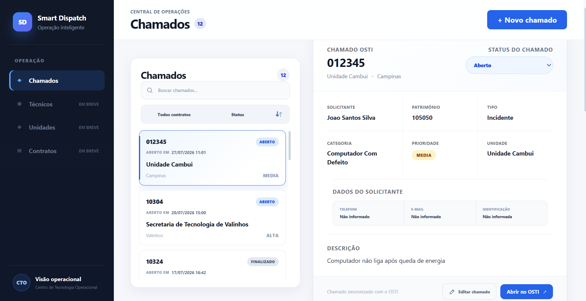
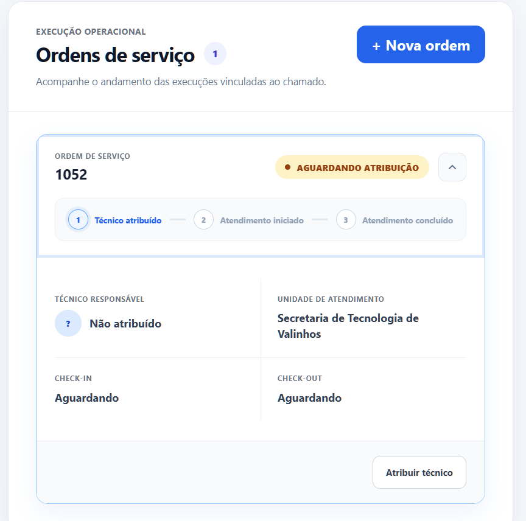
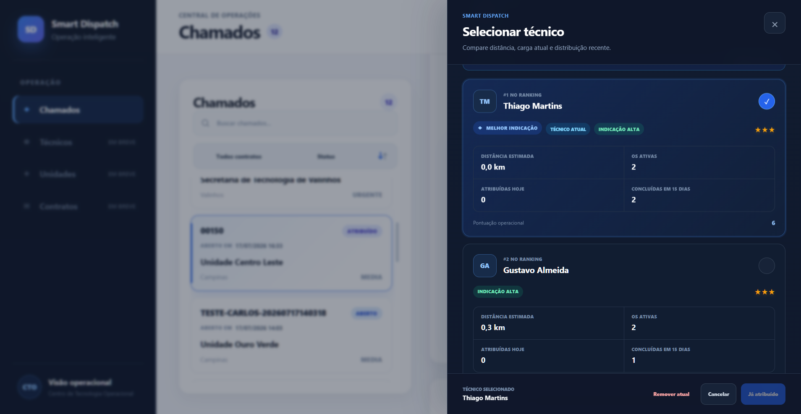
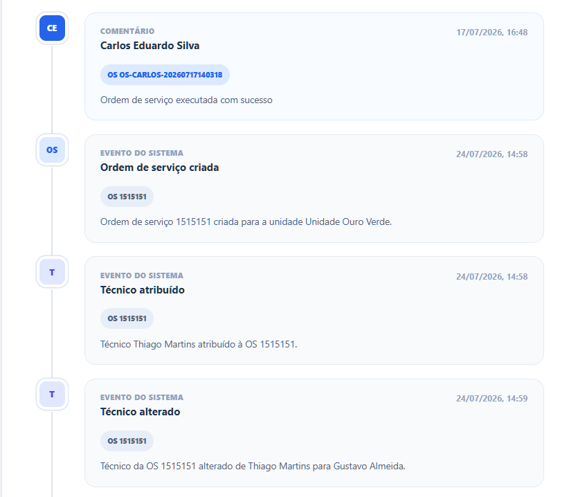
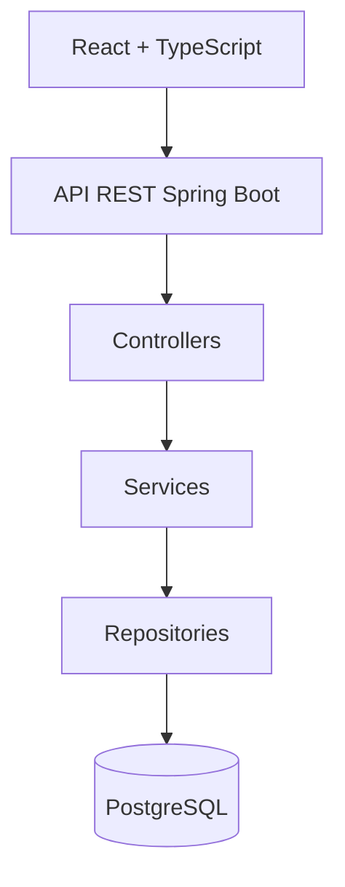

# Smart Dispatch

Plataforma full stack para gestão e distribuição inteligente de chamados técnicos.

O Smart Dispatch auxilia operações de suporte a escolher o técnico mais adequado para cada atendimento, considerando distância, carga atual e distribuição recente de trabalho.

O objetivo central do projeto é **reduzir quilômetros percorridos**, evitar deslocamentos desnecessários e distribuir as ordens de serviço de forma mais equilibrada.

> Projeto autoral desenvolvido com Java, Spring Boot, React, TypeScript e PostgreSQL.

---

## O problema

Em operações com técnicos externos, a distribuição manual de chamados pode gerar:

- técnicos percorrendo distâncias maiores que o necessário;
- concentração de atendimentos nos mesmos profissionais;
- aumento de custos com combustível e deslocamento;
- dificuldade para acompanhar ordens de serviço em andamento;
- perda do histórico das decisões operacionais;
- pouca visibilidade sobre a carga de cada técnico.

O Smart Dispatch centraliza essas informações e transforma a atribuição de técnicos em uma decisão baseada em critérios objetivos.

---

## Como funciona


O operador cria uma ordem de serviço e visualiza uma lista de técnicos classificados pelo sistema.

A decisão final continua sendo humana, mas o sistema apresenta informações suficientes para tornar a escolha mais rápida e consistente.

---

## Ranking de técnicos

A classificação utiliza uma pontuação operacional determinística e auditável.

```text
score =
(distância em km × 4)
+ (ordens de serviço ativas × 2)
+ (atribuições realizadas hoje × 1,5)
+ (atendimentos concluídos nos últimos 15 dias × 1)
```

Quanto **menor o score**, melhor a indicação.

### Critérios considerados

**Distância**

É o critério de maior peso, pois o objetivo principal é reduzir quilômetros percorridos e custos de deslocamento.

**Ordens de serviço ativas**

Evita concentrar novos atendimentos em técnicos que já possuem uma carga operacional elevada.

**Atribuições realizadas no dia**

Ajuda a equilibrar a distribuição diária entre os profissionais disponíveis.

**Atendimentos recentes**

Considera a quantidade de atendimentos concluídos nos últimos 15 dias para evitar concentração recorrente de trabalho.

A recomendação não utiliza inteligência artificial ou aprendizado de máquina. A regra é transparente e pode ser ajustada conforme as prioridades da operação.

---

## Impacto operacional

O projeto foi concebido para gerar impacto principalmente em:

- redução da distância total percorrida;
- redução da média de quilômetros por ordem de serviço;
- economia de combustível;
- menor tempo de deslocamento;
- distribuição mais equilibrada dos atendimentos;
- maior rastreabilidade das decisões.

A economia real ainda será validada por meio de simulações e dados de uso.

Uma etapa futura do projeto será comparar:

```text
Distribuição manual
versus
Distribuição sugerida pelo Smart Dispatch
```

Utilizando indicadores como quilômetros totais, custo estimado de combustível, tempo de deslocamento e carga por técnico.

---

## Demonstração

As informações exibidas nas imagens são dados demonstrativos utilizados para apresentação do projeto.

### Gestão de chamados

Feed com busca, filtros, ordenação e visualização dos detalhes operacionais.



### Ordem de serviço

Acompanhamento da ordem de serviço, técnico responsável, unidade e etapas do atendimento.



### Sugestão inteligente de técnicos

Comparação dos profissionais considerando distância, carga ativa, atribuições recentes e atendimentos concluídos.



### Histórico operacional

Linha do tempo unificada com comentários humanos e eventos automáticos do sistema.



---

## Funcionalidades

### Chamados

- criação e edição;
- associação com contrato e unidade;
- dados do solicitante;
- classificação por tipo, categoria e prioridade;
- atualização de status;
- busca por palavras-chave;
- filtros por contrato e status;
- ordenação por data.

### Ordens de serviço

- múltiplas ordens para o mesmo chamado;
- definição da unidade de atendimento;
- atribuição, troca e remoção de técnico;
- registro da data de atribuição;
- bloqueio de alterações críticas após o check-in.

### Atendimento

- check-in e check-out;
- validação de técnico ativo;
- detecção de outro atendimento em andamento;
- encerramento automático do atendimento anterior;
- atualização automática do status do chamado.

### Rastreabilidade

- comentários humanos;
- eventos automáticos;
- histórico de alterações;
- registro de atribuições;
- registro de início e término dos atendimentos;
- timeline operacional em ordem cronológica.

---

## Arquitetura

O projeto utiliza uma arquitetura em camadas.



### Backend

- controllers para entrada e saída da API;
- services para regras de negócio;
- repositories para persistência;
- DTOs para os contratos da API;
- entidades e enums para representar o domínio.

### Frontend

- componentes React;
- tipagem com TypeScript;
- consumo da API com Fetch;
- estados e filtros locais;
- interface responsiva para acompanhamento operacional.

---

## Tecnologias

### Backend

- Java 21
- Spring Boot
- Spring Web
- Spring Data JPA
- Hibernate
- PostgreSQL
- Maven

### Frontend

- React
- TypeScript
- Vite
- CSS
- Fetch API

### Ferramentas

- Git
- GitHub
- IntelliJ IDEA
- PostgreSQL

---

## Decisões técnicas

Algumas decisões importantes tomadas durante o desenvolvimento:

- separação entre comentários humanos e eventos automáticos;
- histórico vinculado ao chamado e, quando necessário, à ordem de serviço;
- validação das entidades pelo contrato;
- bloqueio de alterações operacionais após o check-in;
- atualização automática do status do chamado;
- ranking baseado em critérios objetivos;
- configuração de credenciais, CORS e URL da API por variáveis de ambiente;
- commits pequenos e organizados por funcionalidade.

---

## Status do projeto

### Implementado

- gestão de chamados;
- busca e filtros;
- edição de chamado;
- ordens de serviço;
- ranking de técnicos;
- atribuição, troca e remoção de técnico;
- check-in e check-out;
- comentários;
- histórico automático;
- timeline operacional;
- configuração segura por variáveis de ambiente.

### Próximas etapas

- estudo de economia de quilômetros;
- painel com indicadores operacionais;
- edição completa de ordens de serviço;
- autenticação e autorização;
- identificação do usuário responsável pelas ações;
- telas de técnicos, unidades e contratos;
- migrations de banco de dados;
- ampliação dos testes automatizados;
- busca global pelo backend;
- paginação;
- deploy da aplicação.

---

<details>
<summary><strong>Executar o projeto localmente</strong></summary>

### Pré-requisitos

- Java 21
- Maven
- PostgreSQL
- Node.js
- npm

### Banco de dados

```sql
CREATE DATABASE smart_dispatch;
```

### Backend

Configure as variáveis apresentadas no `.env.example`:

```env
DB_URL=jdbc:postgresql://localhost:5432/smart_dispatch
DB_USERNAME=postgres
DB_PASSWORD=change_me
CORS_ALLOWED_ORIGINS=http://localhost:5173
```

Execute:

```bash
mvn spring-boot:run
```

### Frontend

```bash
cd frontend
npm install
npm run dev
```

A variável esperada está documentada em `frontend/.env.example`:

```env
VITE_API_URL=http://localhost:8080
```

</details>

---

## Autor

Desenvolvido por [Gustavo Laudelino](https://github.com/gustavo-laudelino).

Projeto criado para portfólio e demonstração de desenvolvimento full stack, modelagem de regras de negócio e resolução de problemas operacionais.