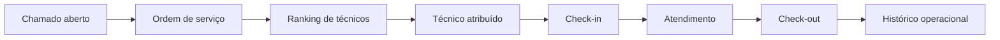
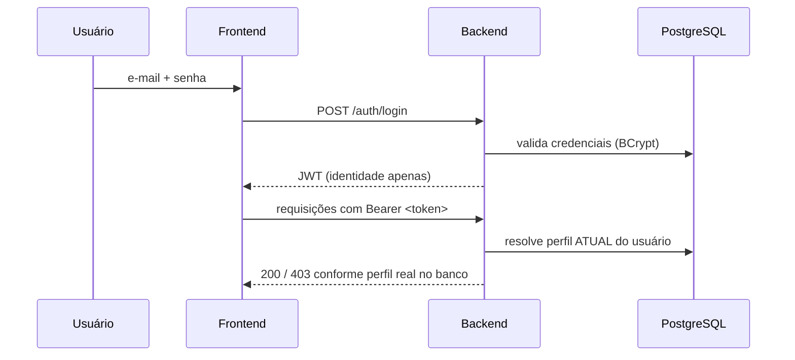
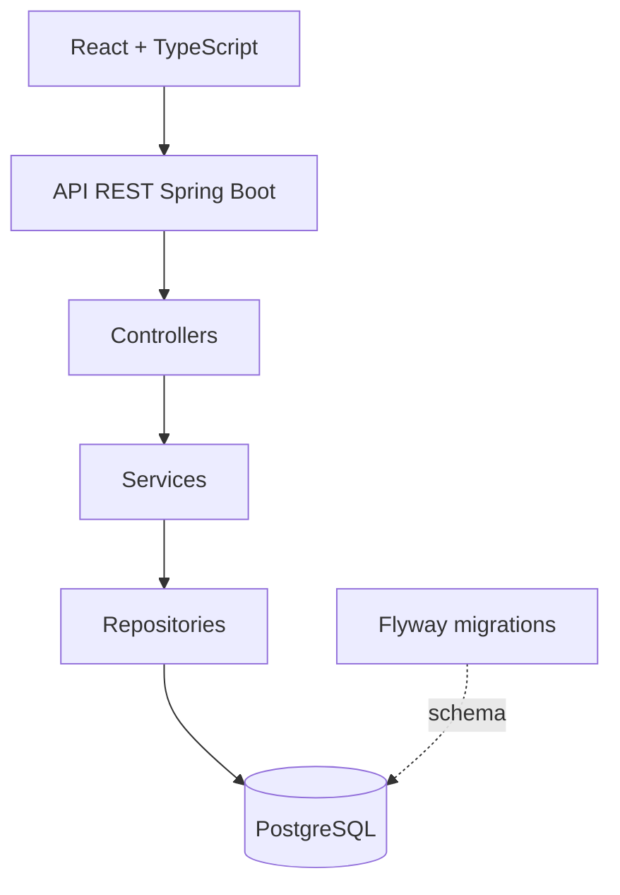

# Smart Dispatch

Plataforma full stack para gestão e distribuição inteligente de chamados técnicos.

O Smart Dispatch auxilia operações de suporte a escolher o técnico mais adequado para cada atendimento, considerando distância, carga atual e distribuição recente de trabalho.

O objetivo central do projeto é **reduzir quilômetros percorridos**, evitar deslocamentos desnecessários e distribuir as ordens de serviço de forma mais equilibrada.

> Projeto autoral desenvolvido com Java, Spring Boot, React, TypeScript e PostgreSQL.

---

## O problema

Em operações com técnicos externos, a distribuição manual de chamados pode gerar:

- técnicos percorrendo distâncias maiores que o necessário;
- concentração de atendimentos nos mesmos profissionais;
- aumento de custos com combustível e deslocamento;
- dificuldade para acompanhar ordens de serviço em andamento;
- perda do histórico das decisões operacionais;
- pouca visibilidade sobre a carga de cada técnico.

O Smart Dispatch centraliza essas informações e transforma a atribuição de técnicos em uma decisão baseada em critérios objetivos.

---

## Como funciona



O operador cria uma ordem de serviço e visualiza uma lista de técnicos classificados pelo sistema.

A decisão final continua sendo humana, mas o sistema apresenta informações suficientes para tornar a escolha mais rápida e consistente. O status do chamado (aberto, atribuído, em atendimento, aguardando análise...) é recalculado automaticamente pelo backend a cada mudança de estado das ordens de serviço vinculadas — nunca definido manualmente para esses estados.

---

## Ranking de técnicos

A classificação utiliza uma pontuação operacional determinística e auditável.

```text
score =
(distância em km × 4)
+ (ordens de serviço ativas × 2)
+ (atribuições realizadas hoje × 1,5)
+ (atendimentos concluídos nos últimos 15 dias × 1)
```

Quanto **menor o score**, melhor a indicação.

### Critérios considerados

**Distância**

É o critério de maior peso, pois o objetivo principal é reduzir quilômetros percorridos e custos de deslocamento. Quando o técnico já possui atendimentos ativos, a distância é calculada a partir da unidade de atendimento mais próxima entre eles — não da base do técnico.

**Ordens de serviço ativas**

Evita concentrar novos atendimentos em técnicos que já possuem uma carga operacional elevada.

**Atribuições realizadas no dia**

Ajuda a equilibrar a distribuição diária entre os profissionais disponíveis.

**Atendimentos recentes**

Considera a quantidade de atendimentos concluídos nos últimos 15 dias para evitar concentração recorrente de trabalho.

A recomendação não utiliza inteligência artificial ou aprendizado de máquina. A regra é transparente, determinística e pode ser ajustada conforme as prioridades da operação.

---

## Autenticação e autorização

- Login via `POST /auth/login`, com JWT autoassinado (HMAC-SHA256, emitido pelo próprio backend — sem provedor de identidade externo).
- O JWT carrega **identidade** (`usuarioId`), não autorização: o perfil (`ADMIN`, `CTO`, `TECNICO`, `TECNICO_INTERNO`) usado para decidir o que o usuário pode fazer é **sempre resolvido no banco a cada requisição**, nunca lido da claim do token.
- Consequência prática: alterar o perfil de um usuário no banco reflete imediatamente em todas as suas requisições seguintes, mesmo com um token antigo ainda dentro da validade — não é preciso esperar o token expirar nem forçar logout.



- `ADMIN`/`CTO` são perfis gestores, com acesso amplo. `TECNICO`/`TECNICO_INTERNO` têm acesso operacional escopado ao próprio contrato.
- Toda rota sensível é protegida por `@PreAuthorize`, validado contra o `SecurityFilterChain` real em testes de integração (não simulado).

---

## Estratégia de testes

O backend segue uma suíte em camadas, cada uma provando algo que a anterior não consegue:

| Camada | O que prova | Ferramenta |
|---|---|---|
| Unitária | Regra de negócio isolada | JUnit 5 + Mockito, sem Spring/banco/HTTP |
| Repository | Queries derivadas do Spring Data realmente geram o SQL esperado | `@DataJpaTest` contra PostgreSQL real |
| HTTP/Security | `SecurityFilterChain`, JWT, `@PreAuthorize` e mapping HTTP de ponta a ponta | `@SpringBootTest` + `MockMvc`, sem mocks de segurança |
| Fluxos críticos | Sequências completas de negócio atravessando várias requisições reais | `@SpringBootTest` + login real a cada passo |

Nenhuma camada usa `@WithMockUser`: a autenticação/autorização testada é sempre o fluxo real (Bearer JWT → `JwtDecoder` → `SecurityFilterChain` → perfil atual no banco → `@PreAuthorize`).

Baseline atual: **411 testes, 0 falhas** (`mvn test`).

---

## Impacto operacional

O projeto foi concebido para gerar impacto principalmente em:

- redução da distância total percorrida;
- redução da média de quilômetros por ordem de serviço;
- economia de combustível;
- menor tempo de deslocamento;
- distribuição mais equilibrada dos atendimentos;
- maior rastreabilidade das decisões.

A economia real ainda será validada por meio de simulações e dados de uso — nenhum número de impacto é afirmado aqui como resultado comprovado.

---

## Demonstração

As informações exibidas nas imagens são dados demonstrativos utilizados para apresentação do projeto.

### Gestão de chamados

Feed com busca, filtros, ordenação e visualização dos detalhes operacionais.


### Ordem de serviço

Acompanhamento da ordem de serviço, técnico responsável, unidade e etapas do atendimento.


### Sugestão inteligente de técnicos

Comparação dos profissionais considerando distância, carga ativa, atribuições recentes e atendimentos concluídos.


### Histórico operacional

Linha do tempo unificada com comentários humanos e eventos automáticos do sistema.


---

## Funcionalidades

### Autenticação

- login com JWT, sessão persistida no navegador;
- perfil real resolvido do banco a cada requisição (seção acima);
- ações e menus adaptados por perfil (gestor vs. técnico).

### Chamados

- criação e edição;
- numeração automática interna por contrato, além do número OSTI/externo;
- associação com contrato e unidade;
- dados do solicitante;
- classificação por tipo, categoria e prioridade;
- atualização de status (automática para estados operacionais, manual para os demais);
- busca por palavras-chave e filtros por contrato, status e técnico;
- ordenação por data.

### Ordens de serviço

- recurso operacional independente do chamado — pode nascer vinculada a um chamado ou ser criada diretamente (OS avulsa);
- numeração automática (sequência própria do sistema, não mais informada pelo cliente);
- tela própria de Ordens de Serviço, com visão diária e semanal (sem grade de horário — hora é só informação do card);
- múltiplas ordens para o mesmo chamado;
- definição da unidade de atendimento, descrição, patrimônio, data e hora;
- atribuição, troca e remoção de técnico, com sugestão automática (por distância, carga ativa e distribuição recente);
- registro da data de atribuição;
- bloqueio de alterações críticas (técnico, unidade, chamado vinculado) após o check-in.

### Atendimento

- check-in e check-out;
- validação de técnico ativo;
- detecção de outro atendimento em andamento, com encerramento automático opcional;
- atualização automática do status do chamado.

### Rastreabilidade

- comentários humanos, vinculáveis a uma ordem de serviço específica;
- eventos automáticos do sistema (criação, atribuição, início/fim de atendimento);
- histórico de alterações;
- timeline operacional em ordem cronológica.

---

## Arquitetura

O projeto utiliza uma arquitetura em camadas.



### Backend

- controllers para entrada e saída da API, autorização via `@PreAuthorize`;
- services para regras de negócio;
- repositories para persistência (Spring Data JPA);
- DTOs para os contratos da API;
- entidades e enums para representar o domínio;
- schema de banco versionado e gerenciado por **Flyway** (Hibernate só valida, não altera schema — `ddl-auto=validate`).

### Frontend

- componentes React;
- tipagem com TypeScript;
- consumo da API com um wrapper fino sobre `fetch` (injeta o Bearer token, trata expiração de sessão);
- estados e filtros locais;
- interface responsiva para acompanhamento operacional.

---

## Tecnologias

### Backend

- Java 21
- Spring Boot 4
- Spring Web, Spring Data JPA, Spring Security + OAuth2 Resource Server
- Hibernate
- PostgreSQL
- Flyway
- Maven
- JUnit 5, Mockito, MockMvc

### Frontend

- React 19
- TypeScript
- Vite
- CSS
- Fetch API

### Ferramentas / CI

- Git, GitHub
- IntelliJ IDEA
- GitHub Actions — roda a suíte de backend (`mvn test`, contra PostgreSQL real efêmero) e o pipeline de frontend (`npm ci` / `lint` / `build`) a cada push e pull request para `main`.

---

## Decisões técnicas

Algumas decisões importantes tomadas durante o desenvolvimento:

- autorização sempre resolvida a partir do perfil atual no banco, nunca confiando apenas na claim do JWT;
- separação entre comentários humanos e eventos automáticos;
- histórico vinculado ao chamado e, quando necessário, à ordem de serviço;
- validação das entidades pelo contrato (isolamento operacional multi-tenant);
- bloqueio de alterações operacionais após o check-in;
- atualização automática do status do chamado, com prioridade fixa e testada entre os estados possíveis;
- ranking baseado em critérios objetivos, sem IA/ML;
- schema de banco gerenciado por Flyway, não por `ddl-auto` do Hibernate;
- configuração de credenciais, CORS, JWT e URL da API por variáveis de ambiente — nenhum segredo no código;
- commits pequenos e organizados por funcionalidade.

---

## Status do projeto

### Implementado

- autenticação e autorização (JWT + perfil resolvido do banco);
- gestão de chamados, com busca e filtros (incluindo por técnico);
- edição de chamado;
- ordens de serviço como recurso independente (com ou sem chamado vinculado), numeração automática, tela própria com visão diária/semanal, ranking e atribuição de técnico;
- check-in e check-out, com atualização automática de status e confirmação de troca quando o técnico já tem um atendimento ativo em outra OS;
- comentários e histórico automático (para OS vinculadas a um chamado — ver limitações);
- timeline operacional;
- schema de banco versionado (Flyway);
- suíte de testes em camadas (411 testes) e CI;
- configuração segura por variáveis de ambiente.

### Limitações conhecidas da V1

Decisões e lacunas conscientes, não bugs não percebidos:

- não há tela própria para cadastrar Contrato, Unidade, Base Operacional ou Técnico — hoje isso é feito via API/Swagger (ver seção de execução local para um atalho com dados de demonstração já semeados);
- uma ordem de serviço avulsa (sem chamado vinculado) não gera eventos na timeline/histórico — o histórico automático hoje só existe para OS vinculadas a um chamado;
- senha inicial/reset de usuário é fixa (`"cto"`) — decisão de MVP, não pensada para produção real;
- inativar um usuário não revoga imediatamente um JWT já emitido (o acesso persiste até a expiração natural, até 12h);
- o filtro de status e a busca textual do feed de chamados operam sobre a página já carregada (client-side), diferente dos filtros por contrato/técnico, que são aplicados no backend antes da paginação;
- a tela de Ordens de Serviço sempre exige um contrato selecionado — diferente do feed de Chamados, não existe uma visão "todos os contratos" para OS.

### Roadmap V2

Direção já mapeada, ainda não implementada nesta versão:

- histórico/timeline dedicado para ordens de serviço avulsas;
- recorrência de Ordem de Serviço (atividades periódicas);
- evidências de atendimento (laudo, fotos, assinatura);
- registro de presença do técnico na base, independente de atendimento a chamado;
- criação de Ordem de Serviço pelo próprio técnico (hoje restrita a `ADMIN`/`CTO`);
- evolução da arquitetura para suportar múltiplos tenants (hoje o isolamento é por contrato dentro de um único banco).

---

<details>
<summary><strong>Executar o projeto localmente</strong></summary>

### Pré-requisitos

- Java 21
- Maven
- PostgreSQL
- Node.js
- npm

### Banco de dados

O schema é criado e versionado automaticamente pelo **Flyway** ao subir a aplicação — não é preciso rodar nenhum DDL manual. Só é necessário criar o banco vazio:

```sql
CREATE DATABASE smart_dispatch;
```

### Backend

Copie `.env.example` para `.env` (ou exporte as variáveis do jeito equivalente no seu sistema) e preencha:

```env
DB_URL=jdbc:postgresql://localhost:5432/smart_dispatch
DB_USERNAME=postgres
DB_PASSWORD=change_me

# Precisa ser uma string em Base64 (ex.: gere com `openssl rand -base64 32`)
JWT_SECRET=change_me_base64_secret

CORS_ALLOWED_ORIGINS=http://localhost:5173
```

Execute:

```bash
mvn spring-boot:run
```

Na primeira subida, o Flyway cria o schema e já popula um usuário administrador e um pequeno conjunto de dados de demonstração (um contrato, uma base operacional, uma unidade e um técnico), o suficiente para explorar o fluxo completo pela UI sem precisar do Swagger primeiro:

| Perfil | E-mail | Senha |
|---|---|---|
| ADMIN | `admin@smartdispatch.local` | `cto` |
| TECNICO | `tecnico@smartdispatch.local` | `cto` |

Esse usuário e os dados de demonstração são seeds mantidos deliberadamente na cadeia padrão de migrations (`V2`/`V3`), para que o projeto seja demonstrável assim que clonado — uma decisão consciente para o estágio atual (portfólio, sem alvo de deploy real definido). Antes de qualquer implantação produtiva, essa estratégia deve ser revisada conforme os ambientes concretos daquele deploy.

Documentação interativa da API (Swagger) disponível em `http://localhost:8080/swagger-ui.html` após subir o backend.

### Frontend

```bash
cd frontend
npm install
npm run dev
```

A variável esperada está documentada em `frontend/.env.example`:

```env
VITE_API_URL=http://localhost:8080
```

### Testes

```bash
mvn test
```

Usa um banco de teste separado (`smart_dispatch_test` por padrão, configurável via `TEST_DB_URL`/`TEST_DB_USERNAME`/`TEST_DB_PASSWORD`) — nunca o banco normal. O schema desse banco também é gerenciado pelo Flyway.

</details>

---

## Autor

Desenvolvido por [Gustavo Laudelino](https://github.com/gustavo-laudelino).

Projeto criado para portfólio e demonstração de desenvolvimento full stack, modelagem de regras de negócio e resolução de problemas operacionais.
